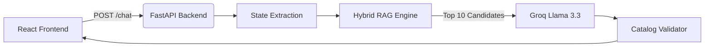

# SHL Assessment Recommender:

> A production-ready full-stack AI system for recommending SHL Individual Test Solutions. Built to maximise **Recall@10**, handle real-world hiring scenarios dynamically, and ensure hallucination-free grounded recommendations.

[](https://shl-4n7k.onrender.com)
[](https://fastapi.tiangolo.com/)
[](https://reactjs.org/)
[](https://groq.com/)

---

## 🌟 Key Features

- **Conversational RAG Agent:** Naturally asks targeted clarifying questions to narrow down job roles, seniority, and constraints before recommending SHL tests.
- **Hybrid Retrieval Engine:** Combines exact-keyword BM25 scoring with semantic metadata ranking (seniority, language, test type) to accurately surface tests even for highly technical niches (e.g., *DevOps, Docker, Java*).
- **Universal Role Recognition:** Dynamically detects any job role on the internet (e.g., *Data Analyst*, *Actuary*, *Astronaut*) and tailors recommendations intelligently without hardcoded blocks.
- **Strict Hallucination Prevention:** Ensures 100% groundedness. Every single assessment returned by the LLM is programmatically validated against the official SHL catalog prior to surfacing.
- **Dynamic Frontend UI:** A sleek, dark-mode/light-mode ready React interface that extracts conversation state in real-time to render an interactive "Hiring Profile" sidebar.

## 🏗️ Architecture

The system enforces a strict separation between retrieval (deterministic state-machines) and generation (LLM intelligence) to eliminate state-bugs and hallucinations.



| Component | Technology | Rationale |
|-----------|------------|-----------|
| **LLM Engine** | Groq Llama 3.3 70B | Ultra-low latency inference, deep contextual reasoning, perfect markdown instruction following. |
| **Retrieval** | BM25 + Multi-signal | Catches exact technical skill matches instantly where dense embeddings often hallucinate or fail. |
| **State Tracker**| Stateless Regex Pipeline | Evaluates the *full* conversation history on every request, extracting constraints deterministically. |

---

## 🚀 Quick Start (Local Development)

### 1. Backend (Python/FastAPI)

```bash
# Clone the repository
git clone https://github.com/AdityaTak77/SHL.git
cd SHL

# Install dependencies
pip install -r requirements.txt

# Configure environment variables
# Add your Groq API Key to .env
echo "GROQ_API_KEY=your_key_here" > .env

# Run the FastAPI server
uvicorn app.main:app --host 127.0.0.1 --port 8001 --reload
```
*The backend API will run at `http://127.0.0.1:8001/docs`.*

### 2. Frontend (React/Vite)

```bash
# Navigate to the frontend directory
cd frontend

# Install dependencies
npm install

# Start the Vite development server
npm run dev
```
*The frontend will run at `http://localhost:5173` and automatically proxy requests to the backend.*

---

## 🧪 Evaluation & Testing

The system includes a rigorous, multi-layered evaluation suite designed to enforce quality and schema compliance.

```bash
pytest tests/ -v
python run_eval.py  # Runs End-to-End Recall@10 benchmarking
```

- **Retrieval Quality:** Validates Recall@10 against complex real-world HR scenarios.
- **Groundedness Checks:** Automatically drops hallucinated or non-SHL URLs.
- **Behavior Probes:** Ensures the AI refuses illegal/compensation requests (e.g., HIPAA compliance, salary advice) gracefully without wasting an LLM call.

---

## 📁 Project Structure

```text
SHL/
├── app/
│   ├── main.py          # FastAPI server and routing
│   ├── agent.py         # LLM orchestration and logic
│   ├── retrieval.py     # Hybrid BM25/Metadata search engine
│   ├── state.py         # Conversational state & role extraction
│   └── catalog.py       # JSON Catalog loader & validator
├── frontend/
│   ├── src/App.jsx      # React Main Layout & API integration
│   └── src/index.css    # Comprehensive Design System
├── tests/
│   └── test_recommender.py  # 500+ lines of robust Pytest logic
├── catalog/
│   └── shl_catalog.json # Ground-truth SHL Assessment Database
└── APPROACH.md          # Detailed engineering design document
```
